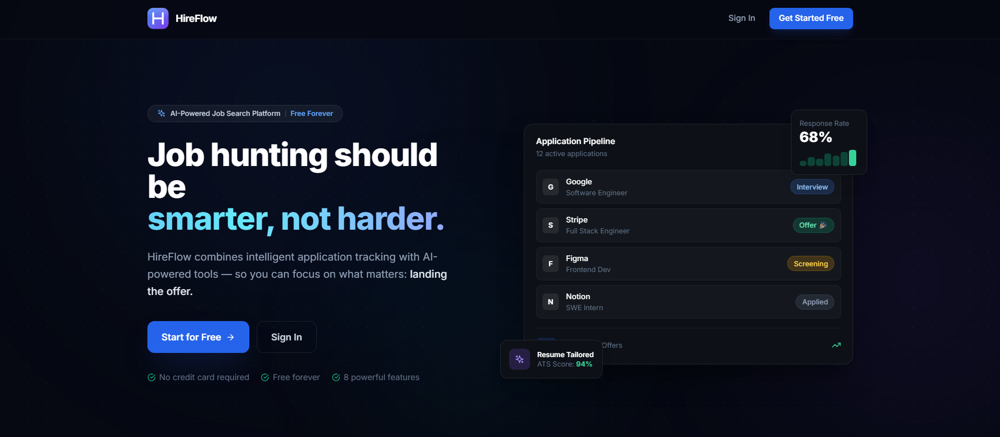
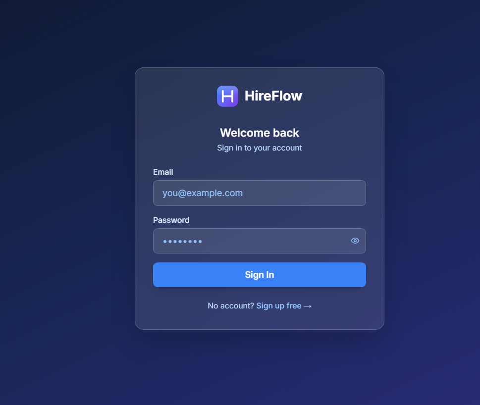
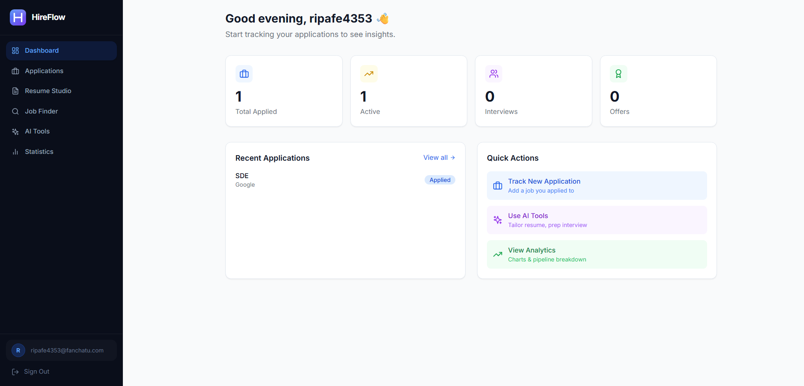
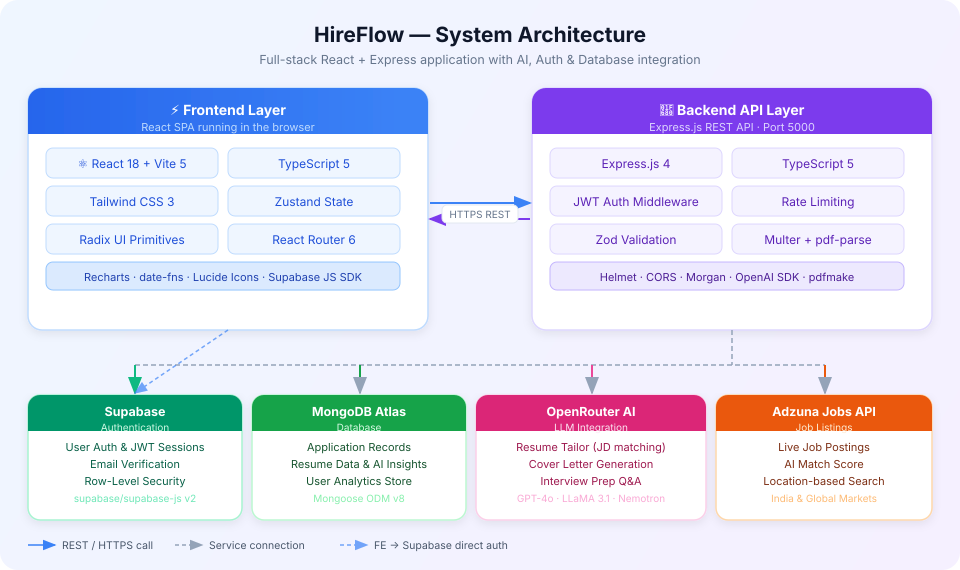
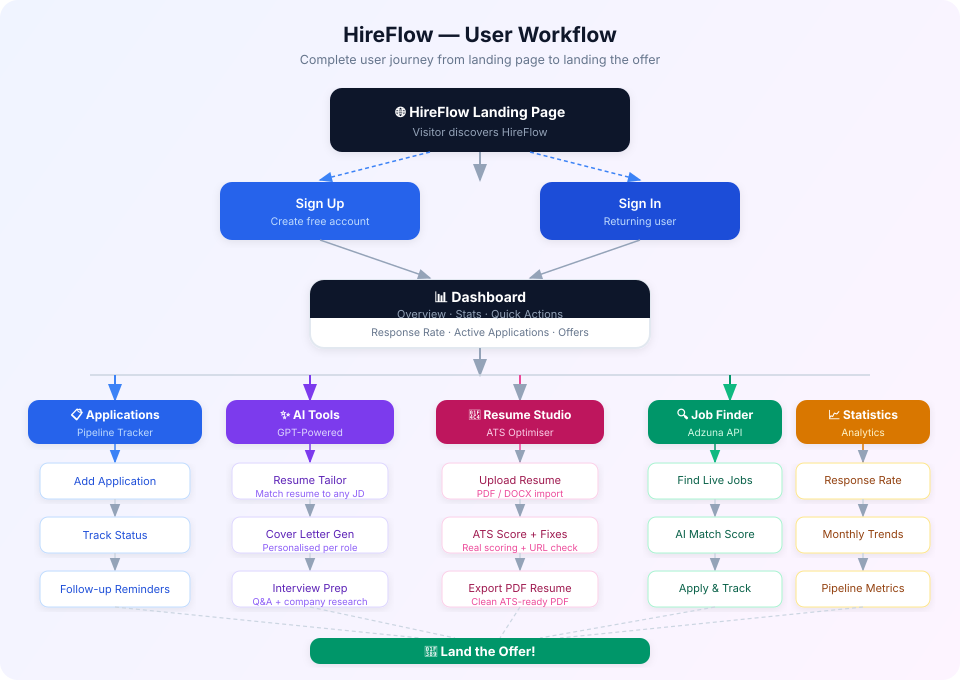

<div align="center">

# HireFlow

**The AI-powered job search platform that helps you track applications, tailor your resume, and land the offer — all in one place.**

[](https://react.dev)
[](https://www.typescriptlang.org)
[](https://expressjs.com)
[](https://www.mongodb.com)
[](https://tailwindcss.com)
[](https://supabase.com)
[](https://openrouter.ai)

</div>

---

## Screenshots

<div align="center">

<table>
  <tr>
    <td align="center" colspan="2">
      <strong>🌐 Landing Page</strong><br/>
      
    </td>
  </tr>
  <tr>
    <td align="center" width="50%">
      <strong>🔐 Login</strong><br/>
      
    </td>
    <td align="center" width="50%">
      <strong>📊 Dashboard</strong><br/>
      
    </td>
  </tr>
</table>

</div>

> **To add screenshots:** save your app screenshots to `docs/screenshots/` as `landing.png`, `login.png`, and `dashboard.png`, then run `git add docs/screenshots/ && git commit -m "docs: add screenshots" && git push`

---

## Features

| Feature | Description |
|---|---|
| **📋 Application Pipeline** | Kanban-style tracker for every job — status, follow-up dates, interview notes |
| **✨ AI Resume Tailor** | Paste any job description and get ATS-optimised resume bullets powered by GPT |
| **💌 Cover Letter Generator** | One-click personalised cover letters matched to the role and company |
| **🎤 Interview Prep** | AI-generated technical & behavioural questions with sample answers |
| **📄 Resume Studio** | Full resume builder with ATS scoring, URL verification, and clean PDF export |
| **🔍 Job Finder** | Browse live listings via Adzuna API with AI-powered match scores |
| **📊 Analytics Dashboard** | Response rates, pipeline velocity, monthly trends and status breakdowns |
| **🔐 Secure Auth** | Supabase JWT authentication — your data is private and isolated |

---

## System Architecture



---

## User Workflow



---

## Tech Stack

### Frontend
- **Framework:** React 18 + Vite 5
- **Language:** TypeScript 5
- **Styling:** Tailwind CSS 3 + Custom CSS animations
- **State:** Zustand
- **UI Primitives:** Radix UI, Lucide React icons
- **Charts:** Recharts
- **Auth Client:** Supabase JS SDK
- **Routing:** React Router 6

### Backend
- **Runtime:** Node.js + Express.js 4
- **Language:** TypeScript 5 (tsx watch)
- **Database:** MongoDB Atlas via Mongoose ODM v8
- **Auth:** Supabase JWT verification middleware
- **AI:** OpenRouter API (GPT-4o, LLaMA 3.1, Nemotron)
- **File Processing:** Multer, pdf-parse, Mammoth, pdfmake
- **Security:** Helmet, CORS, express-rate-limit
- **Validation:** Zod schemas
- **Jobs API:** Adzuna

---

## Getting Started

### Prerequisites

- Node.js 18+
- npm or yarn
- [MongoDB Atlas](https://www.mongodb.com/cloud/atlas) free cluster
- [Supabase](https://supabase.com) project (free tier)
- [OpenRouter](https://openrouter.ai/keys) API key (free tier available)
- [Adzuna](https://developer.adzuna.com) API credentials (optional, for Job Finder)

### 1. Clone the repository

```bash
git clone https://github.com/YOUR_GITHUB_USERNAME/HireFlow.git
cd HireFlow
```

### 2. Set up the Backend

```bash
cd backend
npm install

# Copy the environment template and fill in your values
cp .env.example .env
```

Edit `backend/.env`:

```env
PORT=5000
NODE_ENV=development
MONGODB_URI=mongodb+srv://<user>:<password>@cluster.mongodb.net/?appName=HireFlow
SUPABASE_URL=https://your-project-ref.supabase.co
SUPABASE_SERVICE_ROLE_KEY=your_service_role_key
OPENROUTER_API_KEY=sk-or-v1-your-key-here
ALLOWED_ORIGINS=http://localhost:5173
FRONTEND_URL=http://localhost:5173
ADZUNA_APP_ID=your_adzuna_app_id
ADZUNA_APP_KEY=your_adzuna_app_key
ADZUNA_COUNTRY=in
```

Start the backend in development mode:

```bash
npm run dev
# Server runs on http://localhost:5000
```

### 3. Set up the Frontend

```bash
cd ../frontend
npm install

# Copy the environment template and fill in your values
cp .env.example .env
```

Edit `frontend/.env`:

```env
VITE_SUPABASE_URL=https://your-project.supabase.co
VITE_SUPABASE_ANON_KEY=your_anon_key
VITE_BACKEND_URL=http://localhost:5000
```

Start the frontend:

```bash
npm run dev
# App runs on http://localhost:5173
```

---

## Project Structure

```
HireFlow/
├── frontend/                    # React + Vite SPA
│   ├── src/
│   │   ├── components/
│   │   │   ├── layout/
│   │   │   │   └── Sidebar.tsx  # Dark premium sidebar
│   │   │   ├── Logo.tsx         # HireFlow SVG logo
│   │   │   ├── applications/    # ApplicationCard, ApplicationForm, StatusBadge
│   │   │   ├── ai/              # ResumeTailor, CoverLetterGen, InterviewPrep
│   │   │   ├── resume/          # ResumeUpload, AtsScoreRing, ResumeOptimizer
│   │   │   └── jobs/            # JobCard
│   │   ├── pages/
│   │   │   ├── LandingPage.tsx  # Dark hero + bento features
│   │   │   ├── LoginPage.tsx
│   │   │   ├── SignupPage.tsx
│   │   │   ├── DashboardPage.tsx
│   │   │   ├── ApplicationsPage.tsx
│   │   │   ├── ApplicationDetailPage.tsx
│   │   │   ├── AIToolsPage.tsx
│   │   │   ├── StatsPage.tsx
│   │   │   ├── ResumeStudioPage.tsx
│   │   │   └── JobRecommendationsPage.tsx
│   │   ├── hooks/               # useAuth
│   │   ├── lib/                 # api.ts, supabase.ts
│   │   ├── store/               # useAppStore (Zustand)
│   │   └── types/               # TypeScript interfaces
│   ├── .env.example
│   └── tailwind.config.js
│
├── backend/                     # Express.js REST API
│   ├── src/
│   │   ├── routes/
│   │   │   ├── applications.ts  # CRUD operations
│   │   │   ├── ai.ts            # AI tool endpoints
│   │   │   ├── resume.ts        # Resume operations
│   │   │   ├── stats.ts         # Analytics
│   │   │   └── jobs.ts          # Job recommendations
│   │   ├── models/
│   │   │   └── Application.ts   # Mongoose schema
│   │   ├── middleware/
│   │   │   └── auth.ts          # JWT verification
│   │   ├── utils/
│   │   │   └── openai.ts        # OpenRouter client
│   │   ├── db/
│   │   │   └── mongodb.ts       # DB connection
│   │   └── server.ts            # Express app entry
│   └── .env.example
│
├── docs/
│   ├── architecture.svg         # System architecture diagram
│   ├── workflow.svg             # User workflow diagram
│   └── screenshots/             # App screenshots
│
└── README.md
```

---

## API Routes

| Method | Route | Description |
|---|---|---|
| `GET` | `/api/applications` | List with filters |
| `POST` | `/api/applications` | Create application |
| `PATCH` | `/api/applications/:id` | Update application |
| `DELETE` | `/api/applications/:id` | Delete application |
| `POST` | `/api/ai/tailor-resume` | Generate ATS resume bullets |
| `POST` | `/api/ai/cover-letter` | Generate cover letter |
| `POST` | `/api/ai/interview-prep` | Generate interview Q&A |
| `POST` | `/api/resume/upload` | Parse uploaded PDF/DOCX |
| `POST` | `/api/resume/optimize` | Get ATS score & suggestions |
| `POST` | `/api/resume/generate-pdf` | Export resume as PDF |
| `GET` | `/api/stats` | Get all analytics data |
| `POST` | `/api/jobs/recommend` | Get AI-matched job listings |

---

## Environment Variables Reference

### Backend (`backend/.env`)

| Variable | Required | Description |
|---|---|---|
| `PORT` | No | Server port (default: 5000) |
| `MONGODB_URI` | Yes | MongoDB Atlas connection string |
| `SUPABASE_URL` | Yes | Your Supabase project URL |
| `SUPABASE_SERVICE_ROLE_KEY` | Yes | Service role key (Settings → API) |
| `OPENROUTER_API_KEY` | Yes | OpenRouter API key |
| `ALLOWED_ORIGINS` | Yes | Comma-separated CORS origins |
| `ADZUNA_APP_ID` | No | Adzuna application ID |
| `ADZUNA_APP_KEY` | No | Adzuna API key |

### Frontend (`frontend/.env`)

| Variable | Required | Description |
|---|---|---|
| `VITE_SUPABASE_URL` | Yes | Your Supabase project URL |
| `VITE_SUPABASE_ANON_KEY` | Yes | Supabase anon/public key |
| `VITE_BACKEND_URL` | Yes | Backend API base URL |

---

## License

MIT — feel free to use, fork, and build on it.

---

<div align="center">

Built with ❤️ for ambitious job seekers · 2026

</div>
